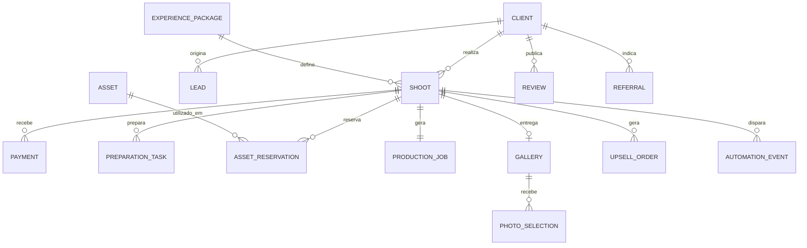
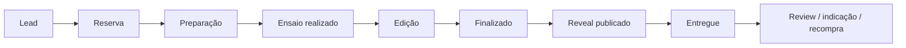

# Stúdio Carol Lucas — Studio OS V2.3
## Modelo de Produto, Dados e Integrações

**Objetivo:** conectar o site público, a Área da Cliente e a operação administrativa do Stúdio Carol Lucas em uma única base de dados, eliminando cadastros duplicados entre agenda, financeiro e edição.

## 1. Princípio central

O **Ensaio** é o registro operacional central. Ele referencia uma cliente e uma experiência/pacote e passa a conectar:

- reserva e agenda;
- pagamentos e saldo;
- preparação da cliente;
- figurinos, clutches e outros recursos reservados;
- produção e edição;
- Reveal e galeria;
- vendas adicionais;
- avaliação, indicação e recompra.

A cliente é o registro de relacionamento central e pode ter vários ensaios ao longo do tempo.

## 2. Ambientes do produto

| Ambiente | Objetivo | Acesso |
|---|---|---|
| Site público | Marca, portfólio, quiz e conversão | Público |
| Minha Experiência | Preparação, styling, agenda, galeria e relacionamento | Cliente autenticada |
| Studio OS / Admin | CRM, agenda, financeiro, produção, acervo e gestão | Equipe autorizada |

Os três ambientes usam o mesmo backend e a mesma base de dados, com permissões diferentes.

## 3. Modelo de dados proposto

### Client
Registro único da cliente.

Campos iniciais:
- `id`
- `name`
- `phone`
- `email`
- `instagram_handle`
- `birthday`
- `source`
- `referrer_client_id`
- `style_profile`
- `notes`
- `marketing_consent`
- `created_at`

### Lead
Interesse antes da reserva.

- `id`
- `client_id` ou dados temporários do contato
- `source` — Instagram, Google, indicação, quiz, WhatsApp etc.
- `occasion`
- `quiz_result`
- `status` — novo, contato, proposta, negociação, ganho, perdido
- `lost_reason`
- `owner`
- `created_at`

### ExperiencePackage
Catálogo interno das experiências.

- `id`
- `name` — Cinderela, Bella, Aurora, Diana
- `base_price`
- `included_photos`
- `duration_minutes`
- `scenes`
- `make_included`
- `outfits_limit`
- `clutch_included`
- `active`

### Shoot
**Entidade central do Studio OS.**

- `id`
- `client_id`
- `experience_package_id`
- `shoot_date`
- `start_time`
- `status`
- `agreed_price`
- `payment_status`
- `participant_count`
- `occasion`
- `referral`
- `notes`
- `portal_enabled`
- `created_at`

### Payment
Nunca deve ser duplicado manualmente em outra tela.

- `id`
- `shoot_id`
- `amount`
- `paid_at`
- `method`
- `status`
- `proof_url`
- `notes`

O saldo é calculado:

`saldo = valor_acordado - soma(pagamentos confirmados)`

### Expense
Saídas independentes de um ensaio.

- `id`
- `date`
- `type` — custo, investimento, funcionário
- `category`
- `amount`
- `method`
- `recurring`
- `proof_url`
- `notes`

### PreparationTask
Checklist visível no Studio OS e, quando apropriado, em Minha Experiência.

Exemplos:
- moodboard;
- escolha de figurinos;
- clutch;
- referência de make;
- confirmação de horário;
- pagamento pendente.

Campos:
- `id`
- `shoot_id`
- `type`
- `title`
- `status`
- `due_at`
- `visible_to_client`
- `completed_at`

### Asset
Acervo interno.

Tipos:
- figurino;
- clutch;
- cenário;
- prop/acessório.

Campos:
- `id`
- `type`
- `name`
- `size`
- `color`
- `photo_url`
- `status`
- `maintenance_notes`

### AssetReservation
Evita conflito de peça entre ensaios.

- `id`
- `asset_id`
- `shoot_id`
- `reserved_from`
- `reserved_until`
- `status`

### ProductionJob
Uma fila operacional por ensaio.

- `shoot_id`
- `status` — Aguardando → Iniciado → Parcial → Finalizado → Entregue
- `editor_user_id`
- `photos_to_edit`
- `delivery_due_at`
- `delivery_at`
- `selection_status`
- `notes`

### Gallery
- `id`
- `shoot_id`
- `provider`
- `external_gallery_id`
- `status`
- `published_at`
- `reveal_enabled`

### PhotoSelection
- `gallery_id`
- `photo_id`
- `favorite`
- `selected_for_package`
- `selected_for_album`

### UpsellOrder
- fotos extras;
- coleção completa;
- álbum;
- impressão/quadro;
- Reel/Stories;
- outros produtos futuros.

### Review / Referral
Fecha o ciclo de relacionamento e mede crescimento por indicação.

## 4. Estado do ensaio

O pagamento tem seu próprio estado em paralelo:

`não iniciado → parcial → pago → reembolsado/cancelado`

## 5. Conexões automáticas principais

### Reserva confirmada
Cria automaticamente:
1. `Shoot`;
2. checklist de preparação;
3. `ProductionJob` em Aguardando;
4. acesso à Área da Cliente;
5. agenda interna;
6. evento de boas-vindas.

### Pagamento registrado
1. cria `Payment`;
2. recalcula saldo;
3. atualiza status financeiro do ensaio;
4. pode liberar etapas condicionadas ao pagamento.

### Produção = Finalizado
1. sinaliza galeria pronta para publicação;
2. cria tarefa de Reveal;
3. muda a mensagem na Área da Cliente.

### Galeria publicada
1. envia comunicação de Reveal;
2. habilita favoritos;
3. habilita upsells pós-ensaio.

### Entrega concluída
1. aciona pedido de review;
2. registra oportunidade de indicação;
3. agenda possível reativação futura.

## 6. Migração da planilha atual

### Aba Ensaios → Shoot + Client
Os registros de Maria Silva, Ana Costa e Joana Lopes podem criar os primeiros clientes e ensaios.

### Aba Financeiro → Payment / Expense
Receitas precisam ser conciliadas com os ensaios antes da migração definitiva. Custos, investimento e funcionário viram `Expense`.

### Aba Edição → ProductionJob
Status, prazo, data real e editor migram para produção.

### Aba Pacotes → ExperiencePackage
Cinderela, Bella, Aurora e Diana viram o catálogo inicial.

### Dashboard
Não deve ser migrado como dado. Ele será reconstruído a partir das entidades normalizadas.

## 7. Divergências detectadas na amostra

Estas divergências devem virar uma etapa explícita de conciliação na migração:

1. **Maria Silva:** a ficha de Ensaios informa entrada de R$ 200, enquanto o Financeiro contém receita de R$ 450 associada ao pacote Bella/Maria.
2. **Joana Lopes:** a ficha de Ensaios informa entrada de R$ 300, mas não existe lançamento de receita correspondente na aba Financeiro da amostra.
3. **Paula Mendes:** existe na aba Edição, porém não aparece na aba Ensaios da amostra.
4. A coluna Saldo da aba Ensaios está negativa para pagamentos parciais; no sistema o saldo será calculado automaticamente como valor menos pagamentos confirmados.
5. O Dashboard atual não deve ser usado como fonte de verdade para migração; seus indicadores serão recalculados a partir dos registros normalizados.

## 8. MVP de desenvolvimento

### P0 — Fundação
- autenticação e papéis;
- Client;
- ExperiencePackage;
- Shoot;
- Payment / Expense;
- ProductionJob;
- auditoria básica.

### P1 — Operação
- dashboard;
- agenda;
- cadastro/ficha de ensaio;
- CRM de clientes;
- financeiro;
- Kanban de edição;
- preparação/checklist;
- Área da Cliente conectada.

### P2 — Experiência e crescimento
- galeria / Reveal integrada;
- favoritos;
- upsells;
- review e indicação;
- automações.

### P3 — Acervo e inteligência
- figurinos/clutches/cenários reserváveis;
- conflitos de agenda de recursos;
- quiz integrado ao CRM;
- assistente contextual;
- prévia de styling/virtual try-on, se validado.

## 9. Requisitos técnicos que a stack deverá suportar

Antes de escolher tecnologia, a arquitetura precisa suportar:
- autenticação para clientes e equipe;
- RBAC/permissões;
- banco relacional;
- uploads e galeria/integração externa;
- webhooks;
- tarefas agendadas e automações;
- trilha de auditoria;
- consentimento e retenção de dados/imagens;
- mobile-first para clientes e operação rápida no estúdio;
- exportação/importação para contingência.

## 10. Métricas do Studio OS

### Comercial
- leads por origem;
- conversão em reserva;
- tempo até fechamento;
- ticket médio por experiência.

### Operação
- ensaios/mês;
- ocupação por dia/horário;
- prazo médio de edição;
- entregas dentro do SLA;
- gargalos por etapa.

### Financeiro
- faturado;
- recebido;
- a receber;
- receita por pacote;
- custo operacional;
- margem;
- receita de upsell.

### Relacionamento
- clientes recorrentes;
- receita por cliente ao longo do tempo;
- indicação;
- reviews;
- NPS/CSAT, se desejado;
- taxa de recompra.

---

**Princípio de implementação:** nunca criar telas que mantenham cópias independentes do mesmo dado. Agenda, financeiro, produção e portal devem ser diferentes visões do mesmo conjunto de entidades.
